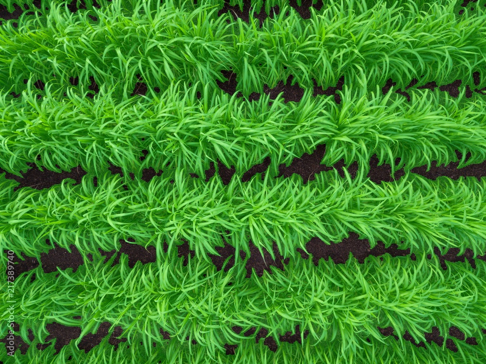

# Desafio IA — Segmentação de Vegetação

Este projeto realiza a segmentação de imagens aéreas (ortomosaicos) para detecção de vegetação, utilizando técnicas de visão computacional e aprendizado de máquina.

## Estrutura do Projeto

## Requisitos

Instale as dependências necessárias:

```bash
pip install -r requirements.txt
```

Bibliotecas:
```
rasterio
opencv-python
numpy
tensorflow
tqdm       
matplotlib   
scikit-learn
```

## Execução

### 1. Divisão do Ortomosaico

```bash
python divide_orthomosaic.py --input orthomosaic.tif --output dataset/crops
```

### 2. Binarização das Imagens

```bash
python binarize_images.py --input dataset/crops --output dataset/masks
```

### 3. Treinamento do Modelo

```bash
python train_model.py --rgb dataset/crops --groundtruth dataset/masks --modelpath model
```

### 4. Inferência com o Modelo Treinado

```bash
python model_inference.py --rgb images_validation --modelpath model/model.h5 --output results
```

## Resultado

<p align="center">
  

